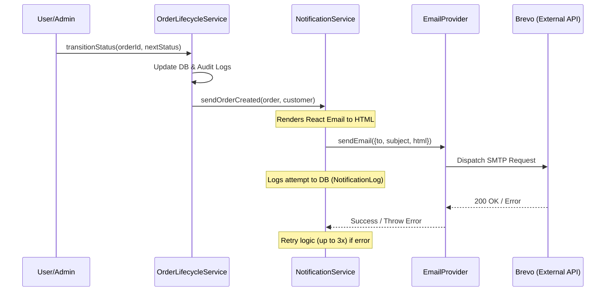

# Notification Architecture

## Overview
The HaiSoLink Logistics application uses a clean architecture for handling email notifications. The system is designed to be completely decoupled from the core business logic, adhering to SOLID principles. We utilize **Brevo (formerly Sendinblue)** as the underlying email provider, and **React Email** for building modern, responsive HTML templates.

## Flow Diagram

## Directory Structure
- `src/providers/`
  - `EmailProvider.ts`: Interface defining the contract for email delivery.
  - `BrevoProvider.ts`: Implementation of `EmailProvider` using Brevo API.
- `src/services/`
  - `NotificationService.ts`: Core dispatcher with retry logic and specific method implementations (e.g. `sendOrderCreated`).
- `src/emails/`
  - React Email components and templates.
- `src/utils/`
  - `emailTemplates.ts`: Utility for rendering React components to HTML strings.
- `src/lib/`
  - `brevo.ts`: Initialization of the Brevo client.

## Core Features
- **Decoupled**: Controllers and business services (like `OrderLifecycleService`) do not interact with Brevo directly. They call specific methods on `NotificationService`.
- **Fault-Tolerant**: Network failures or Brevo API errors do not interrupt the core order transaction. The notification dispatch runs asynchronously and implements exponential backoff retries (3 attempts).
- **Strongly Typed**: Templates use strict properties interface checking via React components.
- **Provider Pattern**: Switching to another provider (e.g., SendGrid, AWS SES) only requires implementing `EmailProvider` and passing it to the `NotificationService`.

## Adding a New Email Template
1. Create a new `.tsx` component inside `src/emails/`.
2. Add a rendering function for it in `src/utils/emailTemplates.ts`.
3. Add a specific dispatcher method to `src/services/NotificationService.ts`.
4. Call this method from the relevant business service (e.g., `OrderLifecycleService.ts`).
